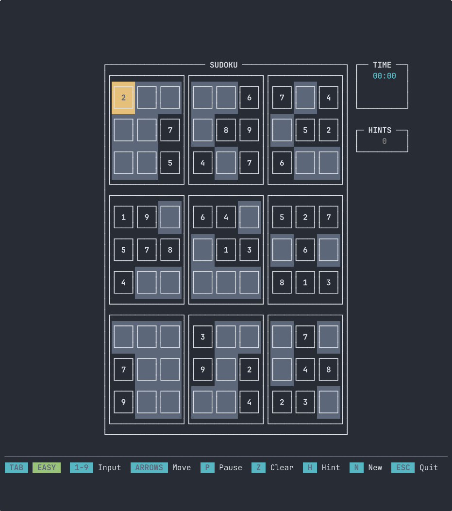

# <center>Sudoku TUI</center>

<p align="center">
A terminal-based Sudoku game built with Rust and the Ratatui library.

  
</p>

## Features

- Interactive terminal UI
- Generate new puzzles
- Validate moves in real-time
- Keyboard navigation and input

## Dependencies

- Rust
- ratatui
- crossterm
- rand

## Build & Run

```bash
cargo build --release
cargo run --release
```

## Controls

- Arrow keys to navigate
- Numbers 1-9 to input
- Z or Backspace to clear
- H to get a hint (fills cell, cannot be cleared)
- P to pause/resume
- TAB to change difficulty
- N to generate new puzzle
- Enter to confirm/continue
- Q or ESC to quit
