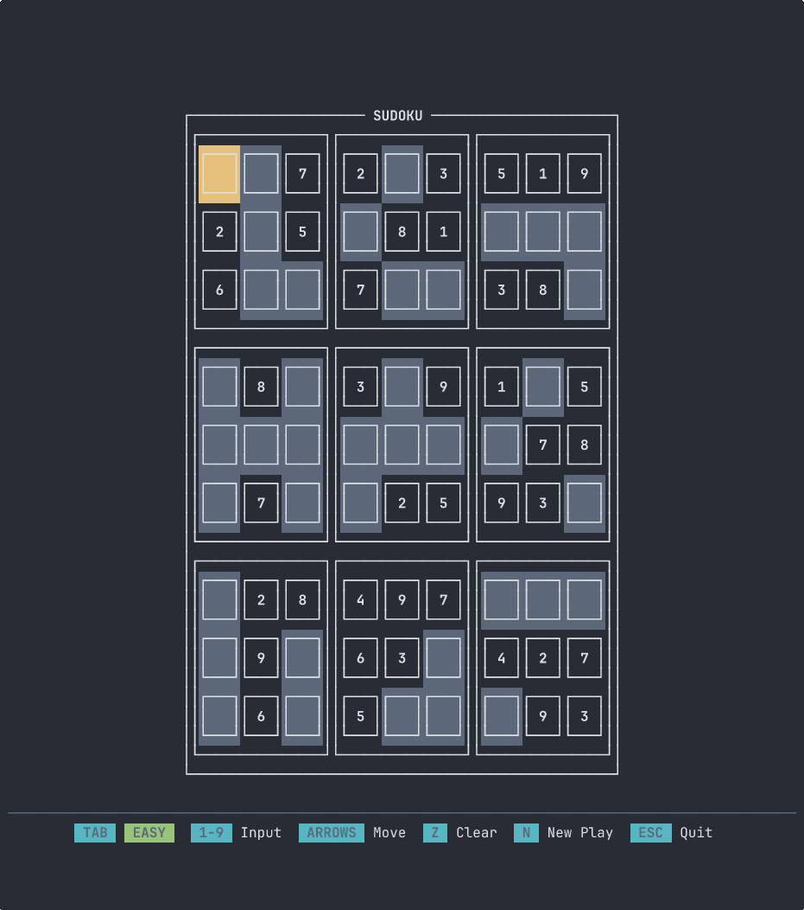

# <center>Sudoku TUI</center>

<p align="center">
Un gioco di Sudoku da terminale costruito con Rust e la libreria Ratatui.

  
</p>


## Caratteristiche

- Interfaccia terminale interattiva
- Genera nuovi puzzle
- Valida le mosse in tempo reale
- Navigazione e input da tastiera

## Dipendenze

- Rust (edition 2024)
- ratatui = "0.30.0"
- crossterm = "0.29"
- rand = "0.10.1"

## Build & Esegui

```bash
cargo build --release
cargo run --release
```

## Controlli

- Frecce per navigare
- Numeri 1-9 per inserire
- N per generare nuovo puzzle
- Q per uscire
